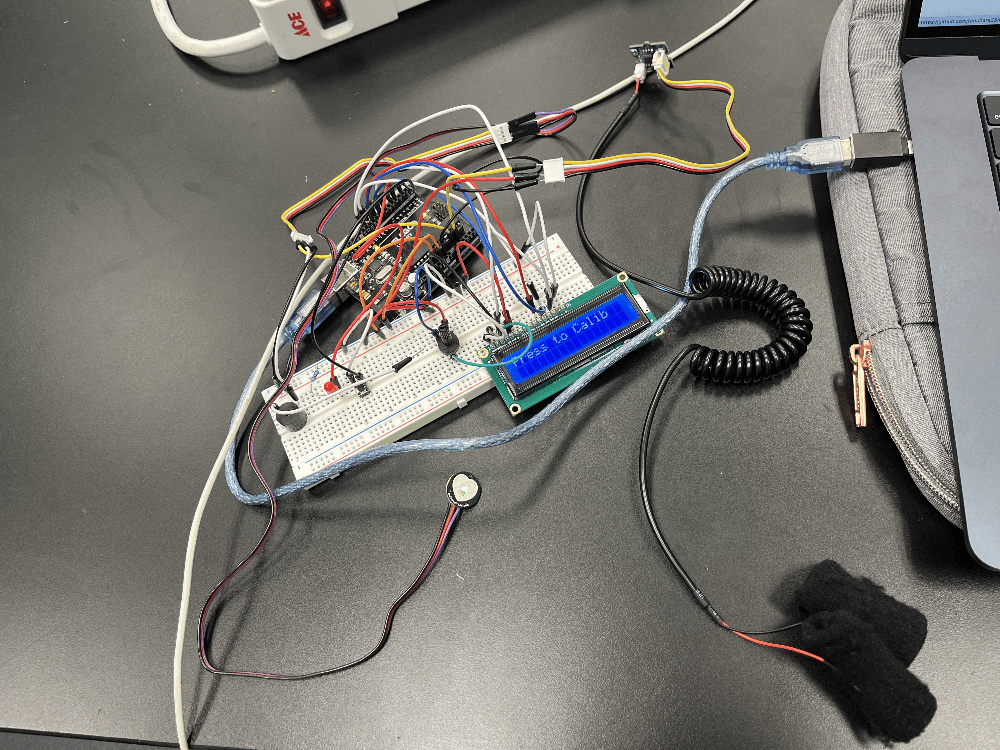
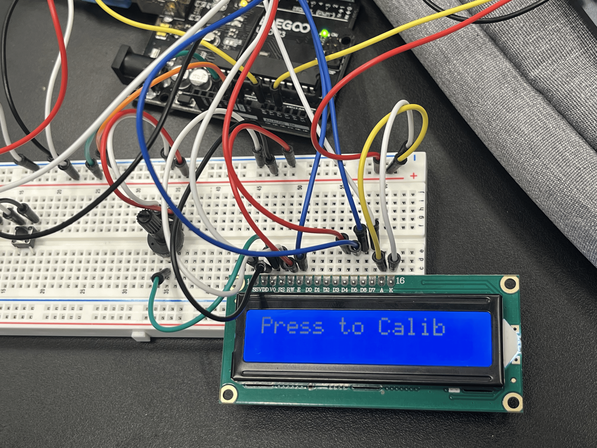
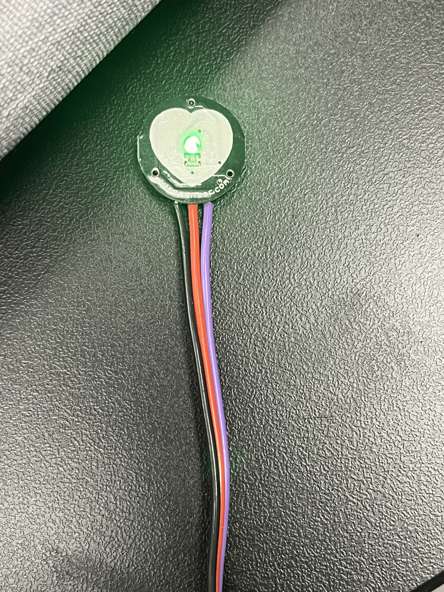
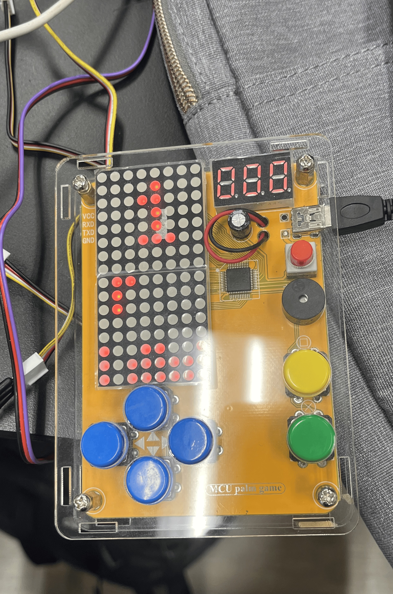

# Lie/Nervousness Detector
At BlueStamp, I decided to create a lie/nervousness detector. This device uses GSR (galvanic skin response) values, which measure the electrical skin conductivity of an individual's skin. Additionally, it uses a heart rate monitor that measures beats per minute to see if there is a spike in an individual's emotions. The lie/nervousness detector identifies the truth by creating a threshold by making a total score of the "spikes" in GSR and BPM. Using the baseline, if an individual's GSR value goes above the threshold, then it likely means that they are lying. 


<!--Replace this text with a brief description (2-3 sentences) of your project. This description should draw the reader in and make them interested in what you've built. You can include what the biggest challenges, takeaways, and triumphs from completing the project were. As you complete your portfolio, remember your audience is less familiar than you are with all that your project entails! For my project, I decided to make a lie/nervousness detector. The lie/nervousness detector uses -->


<!--You should comment out all portions of your portfolio that you have not completed yet, as well as any instructions:-->


<!--- This is an HTML comment in Markdown -->
<!--- Anything between these symbols will not render on the published site -->


| **Engineer** | **School** | **Area of Interest** | **Grade** |
|:--:|:--:|:--:|:--:|
| Ren O | Homestead High School | Civil Engineering | Incoming Senior


<!--**Replace the BlueStamp logo below with an image of yourself and your completed project. Follow the guide [here](https://tomcam.github.io/least-github-pages/adding-images-github-pages-site.html) if you need help.**-->




Lie/Nervousness Detector ([GSR Based Lie Detector Device](https://www.electronicsforu.com/electronics-projects/gsr-based-lie-detector-device))


## Headshot Image


# Modifications



LCD Display ([Arduino](https://docs.arduino.cc/learn/electronics/lcd-displays/))




PulseSensor ([PulseSensor.com](https://pulsesensor.com/))


## Summary
Before starting my project, modifications I wanted to add to my lie/nervousness detector were attaching a heart rate monitor to accurately determine if someone is lying, adding a display on a screen to say if the person is telling the truth, and modifying the code so that it takes in account for different GSR levels when you ask multiple questions. I  achieved my third modification by attaching a button to my lie detector. Adding a button is helpful because being able to press a button before asking a new question helps create a new threshold value every single time. This is helpful because it takes into account the different "calm" levels in either the GSR or BPM. Moving on, I achieved my second modification by linking an LCD to my lie detector. I was able to achieve this by wiring the LCD to my Arduino and programming Arduino code using the library "#include < LiquidCrystal>". Having an LCD improves my lie/nervousness detector because it helps the user to easily recognize if they are lying or not. Finally, I achieved my final milestone by adding a heart rate monitor. Utilizing the heart rate monitor required me to use the library "#include <PulseSensorPlayground.h>". Putting a heart rate monitor enhances my project, since I'm able to use a total score of the GSR and BPM values to accurately detect the truth.

## Challenges
The challenges I faced when achieving these modifications were the wiring and programming of the heart rate monitor to my project. For example, I remember struggling to attach my heart rate monitor to the Arduino because the wiring was messy, which made the monitor unable to read BPM accurately. I was able to overcome this challenge by fixing my wiring so that it wasn't as messy, and using longer jumper wires so that it wouldn't unplug easily. Another challenge I faced was programming the code so that it could take into account the new level of "calmness" of the individual. I overcame this challenge by programming it so that there would be two baselines. Having two baselines is useful so that the lie detector can ignore noise and accurately determine when a person's GSR or BPM "spikes". 


# Final Milestone


<!--**Don't forget to replace the text below with the embedding for your milestone video. Go to Youtube, click Share -> Embed, and copy and paste the code to replace what's below.**-->


<iframe width="560" height="315" src="https://www.youtube.com/embed/SFBsUhI9x_A?si=3gvJb8XzvFDRL4dk" title="YouTube video player" frameborder="0" allow="accelerometer; autoplay; clipboard-write; encrypted-media; gyroscope; picture-in-picture; web-share" referrerpolicy="strict-origin-when-cross-origin" allowfullscreen></iframe>>


<!--For your final milestone, explain the outcome of your project. Key details to include are:
- What you've accomplished since your previous milestone
- What your biggest challenges and triumphs were at BSE
- A summary of key topics you learned about
- What you hope to learn in the future after everything you've learned at BSE-->

## Summary
For my final milestone, I was able to find a threshold that adjusts to an individual's different GSR readings. Through my process of completing this milestone, I learned that a boolean function is used to program true or false functions. With that in mind, I used the boolean function to create a calibration phase, as well as a precalibration phase. The precalibration phase is a vital step to my project because when the GSR readings begin, there are inconsistent values in the beginning because the GSR sensor is stabilizing the value of the person's GSR readings. If there wasn't a precalibration phase, the threshold value to determine if someone is lying or not will not be accurate. What has surprised me so far about the project up to this point is the amount of steps it takes to finish a milestone. Before, I thought the path of completing each milestone was self explanatory and linear, however through my experience of creating the lie/nervousness detector I soon came to realize that it is a non-linear process and isn't as straightforward as I thought. 

## Challenges
A challenge I had in completing this task was learning all the new coding languages. The reason is that, before coming to camp, I had never coded before, so understanding basic coding techniques was hard for me to learn and incorporate into my project. Another challenge I faced was the inconsistent readings from the GSR sensor. The reason is that there would be times when I would lie, and the sensor would not rise. However, I later learned that GSR is not 100% accurate and that it only rises when someone is stressed or overwhelmed, which is not always the case. 


# Second Milestone


<!--**Don't forget to replace the text below with the embedding for your milestone video. Go to Youtube, click Share -> Embed, and copy and paste the code to replace what's below.** -->


<iframe width="560" height="315" src="https://www.youtube.com/embed/pRRHKJGRSHw?si=lcP-HiqLfxEEzcii" title="YouTube video player" frameborder="0" allow="accelerometer; autoplay; clipboard-write; encrypted-media; gyroscope; picture-in-picture; web-share" referrerpolicy="strict-origin-when-cross-origin" allowfullscreen></iframe>

## Summary
For milestone two, I was able to program a loop that calculates the sensor value from the GSR sensor. The loop makes the Arduino find the sum of 500 readings from the GSR sensor. After the loop is finished, it divides the sum of the sensor values by 500 to find the average. Finding the average of the sensor value is important in contributing to my final goal because it helps determine if an individual is lying or not. Using single values from the GSR sensor is not a viable option compared to the average because it is common for people's GSR to fluctuate, due to factors such as nervousness or environment. What has been surprising about the project so far is how important it is to be creative and not follow the instructions step by step. A previous challenge I faced and overcame was that originally, I used the sensor value from the GSR sensor to determine if someone was lying. However, I learned that I had to take into account aspects like nervousness and humidity to accurately determine if a person is lying or not. What needs to be completed before my final milestone is to use my classmates' GSR values to help determine the correct threshold to use. The threshold value is important to my final goal because if the average of the GSR sensor exceeds the threshold, it will help detect if a person is lying. 

## Challenges
A challenge I had in completing milestone two was the coding involved to figure out the correct reading. In the beginning, I had a difficult time understanding how to take in the readings of averages, since I'd never coded on Arduino before. However, through constant trial and error and help from my instructors, I was able to figure out and program a function on Arduino that takes the average of 500 readings to correctly determine if someone is lying or not. Other challenges I faced when completing milestone two were wiring issues. For instance, I had an entire day where I was unsure why the GSR sensor wasn't reading the GSR values properly. However, when taking a proper look, I noticed that the components were wired incorrectly because I didn't color-code the wires. Which is why I immediately color-coded the wires, to make sure wiring issues wouldn't become a problem I would have to face in the future.  


<!--For your second milestone, explain what you've worked on since your previous milestone. You can highlight:
- Technical details of what you've accomplished and how they contribute to the final goal
- What has been surprising about the project so far
- Previous challenges you faced that you overcame
- What needs to be completed before your final milestone -->


# First Milestone

<iframe width="560" height="315" src="https://www.youtube.com/embed/4ujochRYdPQ?si=bf9kOd2_Q00TkyAy" title="YouTube video player" frameborder="0" allow="accelerometer; autoplay; clipboard-write; encrypted-media; gyroscope; picture-in-picture; web-share" referrerpolicy="strict-origin-when-cross-origin" allowfullscreen></iframe>

## Summary
My first milestone for my lie/nervousness detector was to program on Arduino IDE to make my GSR sensor work. I was able to achieve this goal by making my GSR sensor a constant integer to the pin labeled as A2. Then I made an integer called sensorValue, which stores the analog readings from the GSR sensor. Additionally, I coded it so that the buzzer would be coded as an input into pin #13. I made it so that it would beep when it went over the threshold value that I set up. However, this isn't a viable option because I realized that GSR values are different for each person, and that they're not all the same.

## Challenges
The challenges I had with completing my first milestone were wiring the GSR sensor and the buzzer to the Arduino. The reason is that there was a schematic picture on how to wire the GSR sensor to the Arduino, but I had a difficult time interpreting it since I've never done wiring before coming to BlueStamp. With the help of YouTube videos and the instructors, I was finally able to interpret what the schematic meant and finished the wiring of my GSR sensor to the Arduino.


# Bill of Materials
<!--
Here's where you'll list the parts in your project. To add more rows, just copy and paste the example rows below.
Don't forget to place the link of where to buy each component inside the quotation marks in the corresponding row after href =. Follow the guide [here]([url](https://www.markdownguide.org/extended-syntax/)) to learn how to customize this to your project needs. 
-->

| **Parts** | **Notes** | **Prices** | **Links** |
|:--:|:--:|:--:|:--:|
| Arduino UNO/Nano/Micro | Collects, processes, and acts on the data from the GSR sensor | $27.60 | [Link](https://www.amazon.com/Arduino-A000066-ARDUINO-UNO-R3/dp/B008GRTSV6/) |
| GSR Sensor | Measures electrical conductivity of the skin | $37.50 | [Link](https://www.amazon.com/seeed-studio-Seeedstudio-Grove-sensor/dp/B012TNYDE4/ref=asc_df_B012TNYDE4?mcid=07fd999dade6393caa277e2e14e2d7a0&hvocijid=10200397607115446681-B012TNYDE4-&hvexpln=73&tag=hyprod-20&linkCode=df0&hvadid=721245378154&hvpos=&hvnetw=g&hvrand=10200397607115446681&hvpone=&hvptwo=&hvqmt=&hvdev=c&hvdvcmdl=&hvlocint=&hvlocphy=9198079&hvtargid=pla-2281435178618&th=1)|
| Buzzer/Led Vibration | Vibrates to signal a lie | $6.99 | [Link](https://www.amazon.com/Passive-Buzzer-Piezoelectric-Arduino-Raspberry/dp/B0DHGP95K4/ref=asc_df_B0DHGP95K4?mcid=d16130fa11d532098351253b3157a0dc&hvocijid=1103315638036278550-B0DHGP95K4-&hvexpln=73&tag=hyprod-20&linkCode=df0&hvadid=721245378154&hvpos=&hvnetw=g&hvrand=1103315638036278550&hvpone=&hvptwo=&hvqmt=&hvdev=c&hvdvcmdl=&hvlocint=&hvlocphy=9198079&hvtargid=pla-2281435177578&th=1) |
| LCD Display | Displays text that says if you are telling the truth or not | $9.99 | [Link](https://www.amazon.com/SunFounder-Serial-Module-Display-Arduino/dp/B019K5X53O?source=ps-sl-shoppingads-lpcontext&ref_=fplfs&smid=ADHH624DX2Q66&gQT=1&th=1) |
| Potentiometer | Allows the text on the LCD dispaly, to be displayed | $1.25 | [Link](https://www.digikey.com/en/products/detail/sparkfun-electronics/09806/7319606?gQT=1) |
| Button | Starts the calibration process in determing an individual's GSR threshold | $5.39 | [Link](https://www.amazon.com/DAOKI-Miniature-Momentary-Tactile-Quality/dp/B01CGMP9GY/ref=sr_1_1?dib=eyJ2IjoiMSJ9.K8ztKL3l65wCk2uoh4BBBJMY4zTNCQsNILMKyPbG4fdSBQ6lrhluuRno0AbSmEsg-W4MgTNj2MTYJtJNaC0t12kEjFWvHzo8T3YOxx7RrYP6InHrMnkEqEQeFpWXmg-Ib9w2Z43EA5JsxTx7LuJSzskko10kbMVvdCw-8PbhPcj1DJyAK1k-A_xG81icmvnVtSU7vNtPZN1awk7zgjBemBZgGyiTC86YczXgqqpHCWw.EbgecL-NAfoDP5aDUc8DtkuMFuusX_Tbky2qJvPgFwM&dib_tag=se&keywords=arduino%2Bbuttons&qid=1751582504&sr=8-1&th=1)|
| Male to Male Jumper Wires | Used to attach components to the Arduino board | $3.99 | [Link](https://www.amazon.com/California-JOS-Breadboard-Optional-Multicolored/dp/B0BRTJQZRD/ref=asc_df_B0BRTJQZRD?mcid=5398d876283e3735ba72e24ca978b618&hvocijid=4960130646671773467-B0BRTJQZRD-&hvexpln=73&tag=hyprod-20&linkCode=df0&hvadid=721245378154&hvpos=&hvnetw=g&hvrand=4960130646671773467&hvpone=&hvptwo=&hvqmt=&hvdev=c&hvdvcmdl=&hvlocint=&hvlocphy=9032171&hvtargid=pla-2281435179018&th=1)|
| USB-C Adapter | Used to attach the Arduino to my Macbook, so that I can transfer code to it. | $9.99 | [Link](https://www.bestbuy.com/site/insignia-usb-c-to-usb-adapter-black/6473492.p?skuId=6473492&ref=212&loc=1&utm_source=feed&extStoreId=851&gStoreCode=851&gQT=1)|

# Lie/Nervousness Detector Schematic


Lie/Nervousness Detector Schematic

([electronicsforu.com](https://www.electronicsforu.com/electronics-projects/gsr-based-lie-detector-device))

# Code

```cpp

#include <LiquidCrystal.h>
#include <PulseSensorPlayground.h>


const int BUZZER = 5;
const int GSR = A2;
const int LED = 4;
const int BUTTON = 2;
const int PulsePin = A0;


PulseSensorPlayground pulseSensor;


LiquidCrystal lcd(7, 8, 9, 10, 11, 12);


int sensorValue = 0;
int bpm = 0;
float ema = 0;
float baselineEMA = 0;
int baselineBPM = 0;


bool baselineSet = false;
bool collecting = false;
bool calibrating = false;
bool questionAsked = false;
long sumGSR = 0;
long sumBPM = 0;
int count = 0;


float alphaFast = 0.1;
float alphaSlow = 0.05;
int sensitivity = 1;  // Applies to both GSR and BPM
unsigned long buttonPressTime = 0;
const unsigned long preCalDelay = 15000;
const unsigned long calDuration = 20000;


void setup() {
 Serial.begin(9600);
 pinMode(BUZZER, OUTPUT);
 pinMode(LED, OUTPUT);
 pinMode(BUTTON, INPUT_PULLUP);
 digitalWrite(BUZZER, LOW);
 digitalWrite(LED, LOW);


 lcd.begin(16, 2);
 lcd.print("Press to Calib");


 pulseSensor.analogInput(PulsePin);
 pulseSensor.setThreshold(550);
 pulseSensor.begin();
}


void loop() {
 sensorValue = analogRead(GSR);
 bpm = pulseSensor.getBeatsPerMinute();


 
 if (!baselineSet && !collecting && digitalRead(BUTTON) == LOW) {
   collecting = true;
   buttonPressTime = millis();
   lcd.clear();
   lcd.print("Wait 15 sec...");
   delay(500);
 }


 
 if (collecting && !calibrating && millis() - buttonPressTime < preCalDelay) {
   delay(10);
   return;
 }


 
 if (collecting && !calibrating && millis() - buttonPressTime >= preCalDelay) {
   calibrating = true;
   sumGSR = 0;
   sumBPM = 0;
   count = 0;
   buttonPressTime = millis();
   lcd.clear();
   lcd.print("Calibrating...");
   delay(10);
 }


 
 if (calibrating && millis() - buttonPressTime < calDuration) {
   sumGSR += sensorValue;
   sumBPM += bpm;
   count++;
   delay(10);
   return;
 }


 
 if (calibrating && millis() - buttonPressTime >= calDuration) {
   float avgGSR = sumGSR / (float)count;
   baselineEMA = avgGSR;
   ema = avgGSR;
   baselineBPM = sumBPM / count;


   baselineSet = true;
   collecting = false;
   calibrating = false;


   lcd.clear();
   lcd.setCursor(0, 0);
   lcd.print("Baseline Set");
   lcd.setCursor(0, 1);
   lcd.print("Avg GSR: ");
   lcd.print((int)avgGSR);
   delay(2000);
   lcd.clear();
 }


 
 if (baselineSet) {
   
   ema = alphaFast * sensorValue + (1 - alphaFast) * ema;
   baselineEMA = alphaSlow * ema + (1 - alphaSlow) * baselineEMA;


   
   if (digitalRead(BUTTON) == LOW && !questionAsked) {
     baselineEMA = 0.9 * baselineEMA + 0.1 * ema;
     baselineBPM = 0.9 * baselineBPM + 0.1 * bpm;
     questionAsked = true;


     lcd.clear();
     lcd.setCursor(0, 0);
     lcd.print("New Q Incoming");
     lcd.setCursor(0, 1);
     lcd.print("Recalibrating...");
     delay(1500);
     lcd.clear();
   }
   if (digitalRead(BUTTON) == HIGH) {
     questionAsked = false;
   }


   
   float gsrScore = (ema - baselineEMA) / sensitivity;
   float bpmScore = (bpm - baselineBPM) / sensitivity;
   float totalScore = max(0, gsrScore) + max(0, bpmScore);  
   bool lieDetected = totalScore > 2.0;


   // === Output ===
   lcd.setCursor(0, 0);
   lcd.print("GSR:");
   lcd.print((int)ema);
   lcd.print(" HR:");
   lcd.print(bpm);
   lcd.print(" ");


   lcd.setCursor(0, 1);
   lcd.print("Score:");
   lcd.print(totalScore, 1);
   if (lieDetected) {
     lcd.print(" Lie ");
     digitalWrite(BUZZER, HIGH);
     digitalWrite(LED, HIGH);
   } else {
     lcd.print("     ");
     digitalWrite(BUZZER, LOW);
     digitalWrite(LED, LOW);
   }


   
   Serial.print("EMA:");
   Serial.print(ema);
   Serial.print(" BPM:");
   Serial.print(bpm);
   Serial.print(" Score:");
   Serial.println(totalScore);
   delay(10);
 }
}

```


# Starter Project
<iframe width="560" height="315" src="https://www.youtube.com/embed/86wupSU3Qbg?si=v7565gstihsWf3Gy" title="YouTube video player" frameborder="0" allow="accelerometer; autoplay; clipboard-write; encrypted-media; gyroscope; picture-in-picture; web-share" referrerpolicy="strict-origin-when-cross-origin" allowfullscreen></iframe>




Retro Arcade Console


## Summary
For my starter project, I created a retro arcade console. I wanted to create the retro arcade console because I love playing video games, and I thought it would be intriguing to create and assemble one on my own. The retro arcade console is able to play games such as Snake and Tetris. Additionally, the console can be used by powering it through a plug or batteries. The retro arcade console took me two days to create. Once I completed the project, I was proud of myself because before entering BlueStamp, I didn't think I would be able to manufacture the console properly, as it looked complicated to do.
## Challenges
A challenge I had in completing my starter project was the soldering. Before coming to BlueStamp, I had never done soldering, so initially I had a difficult time soldering the components together. For example, I would either over-solder or undersolder the wires to the circuit board, short-circuiting the pieces, making the retro arcade console unusable. Also, I remember on the first day I soldered the helping hands together. I was able to overcome this challenge by getting advice from my instructors as well as from YouTube. These resources told me that undersoldering is better than oversoldering. Once I understood that, I had an easier time soldering the pieces together to create the retro arcade console. Another challenge I had in completing my starter project was understanding the manual. Since I remember, there were many times during this process when I wasn't able to comprehend what the instructions were telling me to do. I overcame this challenge by asking my peers and my instructors, who helped simplify the language for me. 

# Starter Project Schematic

<!--Here's where you'll put images of your schematics. [Tinkercad](https://www.tinkercad.com/blog/official-guide-to-tinkercad-circuits) and [Fritzing](https://fritzing.org/learning/) are both great resoruces to create professional schematic diagrams, though BSE recommends Tinkercad becuase it can be done easily and for free in the browser. -->


Retro Arcade Console Schematic

([Hackster.io](https://www.hackster.io/lewisdiy/build-your-own-game-console-kit-play-the-classic-games-5ca95fz0))


<!--Here's where you'll put your code. The syntax below places it into a block of code. Follow the guide [here]([url](https://www.markdownguide.org/extended-syntax/)) to learn how to customize it to your project needs. 

```c++
void setup() {
  // put your setup code here, to run once:
  Serial.begin(9600);
  Serial.println("Hello World!");
}

void loop() {
  // put your main code here, to run repeatedly:

}
```-->


<!--
# Other Resources/Examples
One of the best parts about Github is that you can view how other people set up their own work. Here are some past BSE portfolios that are awesome examples. You can view how they set up their portfolio, and you can view their index.md files to understand how they implemented different portfolio components.
- [Example 1](https://trashytuber.github.io/YimingJiaBlueStamp/)
- [Example 2](https://sviatil0.github.io/Sviatoslav_BSE/)
- [Example 3](https://arneshkumar.github.io/arneshbluestamp/)

To watch the BSE tutorial on how to create a portfolio, click here.
-->
