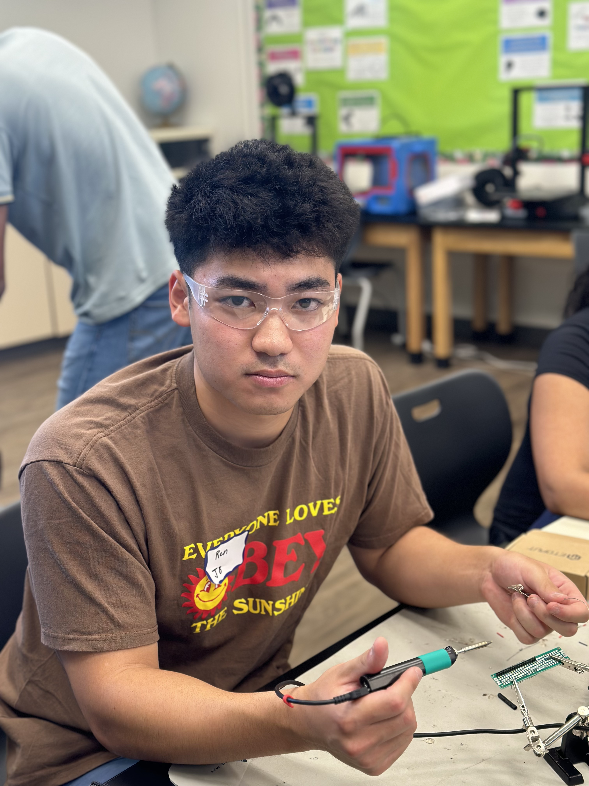
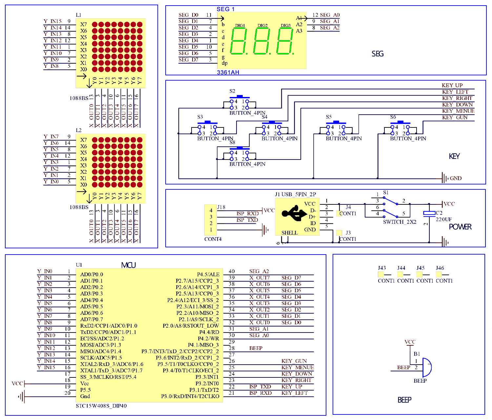
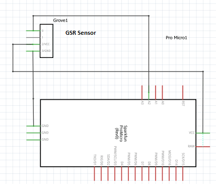

# Lie/Nervousness Detector
At BlueStamp I decided to create a lie/nervousness detector. This device uses GSR values, that stands for galvanic skin response, which is a measure of the electrical skin conductivity individual's skin. With the help of my device you are able to decipher the truth by seeing if there is a rise in the GSR values, compared to the averge of an individual's avergae GSR value. 


<!--Replace this text with a brief description (2-3 sentences) of your project. This description should draw the reader in and make them interested in what you've built. You can include what the biggest challenges, takeaways, and triumphs from completing the project were. As you complete your portfolio, remember your audience is less familiar than you are with all that your project entails! For my project, I decided to make a lie/nervousness detector. The lie/nervousness detector uses -->


<!--You should comment out all portions of your portfolio that you have not completed yet, as well as any instructions:-->


<!--- This is an HTML comment in Markdown -->
<!--- Anything between these symbols will not render on the published site -->


| **Engineer** | **School** | **Area of Interest** | **Grade** |
|:--:|:--:|:--:|:--:|
| Ren O | Homestead High School | Computer Engineering | Incoming Senior


<!--**Replace the BlueStamp logo below with an image of yourself and your completed project. Follow the guide [here](https://tomcam.github.io/least-github-pages/adding-images-github-pages-site.html) if you need help.**-->



  
# Final Milestone


<!--**Don't forget to replace the text below with the embedding for your milestone video. Go to Youtube, click Share -> Embed, and copy and paste the code to replace what's below.**-->


<iframe width="560" height="315" src="https://www.youtube.com/embed/F7M7imOVGug" title="YouTube video player" frameborder="0" allow="accelerometer; autoplay; clipboard-write; encrypted-media; gyroscope; picture-in-picture; web-share" allowfullscreen></iframe>


For milestone three I was able to find a threshold that is able to adjust to peoples' different GSR readings. Through this process of completing this task I learned what a boolean function was, and used this function to create a calibration phase, as well as a precalibratuion phase. The precalibration phase is important to my project because 

For your final milestone, explain the outcome of your project. Key details to include are:
- What you've accomplished since your previous milestone
- What your biggest challenges and triumphs were at BSE
- A summary of key topics you learned about
- What you hope to learn in the future after everything you've learned at BSE

## Summary
For milestone three I was able to find a threshold that is able to adjust to peoples' different GSR readings. Through this process of completing this task, I learned what a boolean function was, and used this function to create a calibration phase, as well as a precalibration phase. The precalibration phase is important to my project because when the GSR readings begins, there are inconsistent values, as the GSR sensor is stabilizing the value of the person's GSR readings. 
## Challenges
A challenge I had in completing this task was learningh all the new coding language. The reason is because prior to coming to camp, I've never coded before, so learning all the basic coding techniques were hard for me to learn and incorporate in my project. Another challenge I had was the inconsistent readings from the GSR sensor. The reason is because there would be times where I would lie and the sensor would not rise. However, I later learned that GSR is not 100% accurate and that it only rises if someone is stressed or overwhelmed. 


# Second Milestone


<!--**Don't forget to replace the text below with the embedding for your milestone video. Go to Youtube, click Share -> Embed, and copy and paste the code to replace what's below.** -->


<iframe width="560" height="315" src="https://www.youtube.com/embed/pRRHKJGRSHw?si=lcP-HiqLfxEEzcii" title="YouTube video player" frameborder="0" allow="accelerometer; autoplay; clipboard-write; encrypted-media; gyroscope; picture-in-picture; web-share" referrerpolicy="strict-origin-when-cross-origin" allowfullscreen></iframe>

## Summary
For milestone two, I was able to program a loop that will calculate the sensor value from the GSR sensor. The loop makes the Arduino find the sum of 500 readings from the GSR sensor. After the loop is finished it divides the sum of the sensor values by 500 to find the avergae. Finding the average of the sensor value is important in contributing to my final goal because it helps determine if an individual is lying or not. Using single values from the GSR sensor is not a viable option compared to the average because it is common for people's GSR to fluctuate, due to factors such as nervousness or environment. What has been surprising about the project so far is how important it is to be creative, and not follow the instructions step by step. A previous challenge I faced that I overcame was that orginally I used the sensor value from the GSR sensor to determine if someone was lying. However, I learned that I had to taken in account of aspects like nervousness and humidity to accurately determine if a person is lying or not. What needs to be completeed before my final milestone is to use my classmates to help determine the correct threshold to use. the threshold value is important to my final goal because using 6hat value, if the avergae of the GSR sensor exceeds the threshold, it will help figure out if a person is lying. 

## Challenges
A challenge I had in completing milestone two is the coding involved to figure the correct reading. In the beginnning, I had a difficult time understanding how to take in the readings of averages, since I've never coded on Arduino before. However through constant trial and error and help from my instrcutors I was able to figure out and code a function on Arduino that will take 500 readings and use the average to correctly determine if a person is lying or not. 


<!--For your second milestone, explain what you've worked on since your previous milestone. You can highlight:
- Technical details of what you've accomplished and how they contribute to the final goal
- What has been surprising about the project so far
- Previous challenges you faced that you overcame
- What needs to be completed before your final milestone -->


# First Milestone

<iframe width="560" height="315" src="https://www.youtube.com/embed/4ujochRYdPQ?si=bf9kOd2_Q00TkyAy" title="YouTube video player" frameborder="0" allow="accelerometer; autoplay; clipboard-write; encrypted-media; gyroscope; picture-in-picture; web-share" referrerpolicy="strict-origin-when-cross-origin" allowfullscreen></iframe>

## Summary
My first milestone for my lie/nervousness detector was to program on Arduino IDE to make my GSR sensor work. I was able to achieve this goal by making my GSR sensor as a constant integer to pin labeled as A2. Then I made an integer called sensorValue, which stores the analog readings from the GSR sensor. I also coded it so that there would be a buzzer plugged in to pin #13, and it would beep when the GSR values would go over the threshold values that I set up. 

## Challenges
Some challenges I had with completing my first milestone was wiring the GSR sensor and the buzzer to the Arduino. The reason is because there was a schematic picture on wiring the GSR sensor to the Arduino, but I had a difficult time interpreting it since I've never done wiring before coming to BlueStamp. Through the help of Youtiube videos and the instructors, I finally understood what the schematic meant, and was able to finish the wiring of my GSR sensor to the Arduino.

# Starter Project
<iframe width="560" height="315" src="https://www.youtube.com/embed/86wupSU3Qbg?si=v7565gstihsWf3Gy" title="YouTube video player" frameborder="0" allow="accelerometer; autoplay; clipboard-write; encrypted-media; gyroscope; picture-in-picture; web-share" referrerpolicy="strict-origin-when-cross-origin" allowfullscreen></iframe>

## Summary
For my starter project, I chose to create the retro arcade console. I wanted to create the console because I love playing video games, and I thought it would be intriguing to create and assemble one on my own. The retro arcade console has many types of games such as snake and tetris. Additionally, the console is able to be powered through a plug or batteries. 
## Challenges
A challenge I had in completeing my starter project was the soldering. Before coming to BlueStamp I've never done soldering before, so initially I had a very difficult time soldering the components together. For example, I would either over solder or undersolder the wires to the circuit board. However, over time I was able to overcome this challenge by getting advice from my instructors as well as from Youtube. I learned that with soldering, you should think less is more. Once I understood that, I had a easier time soldering the pieces together for the retro arcade console. 

# Schematics 

<!--Here's where you'll put images of your schematics. [Tinkercad](https://www.tinkercad.com/blog/official-guide-to-tinkercad-circuits) and [Fritzing](https://fritzing.org/learning/) are both great resoruces to create professional schematic diagrams, though BSE recommends Tinkercad becuase it can be done easily and for free in the browser. -->


Retro Arcade Console

[Hackster.io](https://www.hackster.io/lewisdiy/build-your-own-game-console-kit-play-the-classic-games-5ca95fz0)



Lie/Nervousness Detector

[electronicsforu.com](https://www.electronicsforu.com/electronics-projects/gsr-based-lie-detector-device)


# Code

<!--Here's where you'll put your code. The syntax below places it into a block of code. Follow the guide [here]([url](https://www.markdownguide.org/extended-syntax/)) to learn how to customize it to your project needs. 

```c++
void setup() {
  // put your setup code here, to run once:
  Serial.begin(9600);
  Serial.println("Hello World!");
}

void loop() {
  // put your main code here, to run repeatedly:

}
```-->


# Bill of Materials
<!--
Here's where you'll list the parts in your project. To add more rows, just copy and paste the example rows below.
Don't forget to place the link of where to buy each component inside the quotation marks in the corresponding row after href =. Follow the guide [here]([url](https://www.markdownguide.org/extended-syntax/)) to learn how to customize this to your project needs. 
-->

| **Part** | **Note** | **Price** | **Link** |
|:--:|:--:|:--:|:--:|
| Arduino UNO/Nano/Micro | Collects, processes, and acts on the data from the GSR sensor | $27.60 | [Link](https://www.amazon.com/Arduino-A000066-ARDUINO-UNO-R3/dp/B008GRTSV6/) |
| GSR Sensor | Measures electrical conductivity of the skin | $37.50 | [Link](https://www.amazon.com/seeed-studio-Seeedstudio-Grove-sensor/dp/B012TNYDE4/ref=asc_df_B012TNYDE4?mcid=07fd999dade6393caa277e2e14e2d7a0&hvocijid=10200397607115446681-B012TNYDE4-&hvexpln=73&tag=hyprod-20&linkCode=df0&hvadid=721245378154&hvpos=&hvnetw=g&hvrand=10200397607115446681&hvpone=&hvptwo=&hvqmt=&hvdev=c&hvdvcmdl=&hvlocint=&hvlocphy=9198079&hvtargid=pla-2281435178618&th=1)|
| Buzzer/Led Vibration | Vibrates to signal a lie | $6.99 | [Link](https://www.amazon.com/Passive-Buzzer-Piezoelectric-Arduino-Raspberry/dp/B0DHGP95K4/ref=asc_df_B0DHGP95K4?mcid=d16130fa11d532098351253b3157a0dc&hvocijid=1103315638036278550-B0DHGP95K4-&hvexpln=73&tag=hyprod-20&linkCode=df0&hvadid=721245378154&hvpos=&hvnetw=g&hvrand=1103315638036278550&hvpone=&hvptwo=&hvqmt=&hvdev=c&hvdvcmdl=&hvlocint=&hvlocphy=9198079&hvtargid=pla-2281435177578&th=1) |
| LCD Display | Displays text that says if you are telling the truth or not | $9.99 | [Link](https://www.amazon.com/SunFounder-Serial-Module-Display-Arduino/dp/B019K5X53O?source=ps-sl-shoppingads-lpcontext&ref_=fplfs&smid=ADHH624DX2Q66&gQT=1&th=1) |
| Potentiometer | Allows the text on the LCD dispaly, to be displayed | $1.25 | [Link](https://www.digikey.com/en/products/detail/sparkfun-electronics/09806/7319606?gQT=1) |
| Button | Starts the calibration process in determing an individual's GSR threshold | $5.39 | [Link](https://www.amazon.com/DAOKI-Miniature-Momentary-Tactile-Quality/dp/B01CGMP9GY/ref=sr_1_1?dib=eyJ2IjoiMSJ9.K8ztKL3l65wCk2uoh4BBBJMY4zTNCQsNILMKyPbG4fdSBQ6lrhluuRno0AbSmEsg-W4MgTNj2MTYJtJNaC0t12kEjFWvHzo8T3YOxx7RrYP6InHrMnkEqEQeFpWXmg-Ib9w2Z43EA5JsxTx7LuJSzskko10kbMVvdCw-8PbhPcj1DJyAK1k-A_xG81icmvnVtSU7vNtPZN1awk7zgjBemBZgGyiTC86YczXgqqpHCWw.EbgecL-NAfoDP5aDUc8DtkuMFuusX_Tbky2qJvPgFwM&dib_tag=se&keywords=arduino%2Bbuttons&qid=1751582504&sr=8-1&th=1)|
| Male to Male Jumper Wires | Used to attach components to the Arduino board | $3.99 | [Link](https://www.amazon.com/California-JOS-Breadboard-Optional-Multicolored/dp/B0BRTJQZRD/ref=asc_df_B0BRTJQZRD?mcid=5398d876283e3735ba72e24ca978b618&hvocijid=4960130646671773467-B0BRTJQZRD-&hvexpln=73&tag=hyprod-20&linkCode=df0&hvadid=721245378154&hvpos=&hvnetw=g&hvrand=4960130646671773467&hvpone=&hvptwo=&hvqmt=&hvdev=c&hvdvcmdl=&hvlocint=&hvlocphy=9032171&hvtargid=pla-2281435179018&th=1)|
<!--
# Other Resources/Examples
One of the best parts about Github is that you can view how other people set up their own work. Here are some past BSE portfolios that are awesome examples. You can view how they set up their portfolio, and you can view their index.md files to understand how they implemented different portfolio components.
- [Example 1](https://trashytuber.github.io/YimingJiaBlueStamp/)
- [Example 2](https://sviatil0.github.io/Sviatoslav_BSE/)
- [Example 3](https://arneshkumar.github.io/arneshbluestamp/)

To watch the BSE tutorial on how to create a portfolio, click here.
-->
